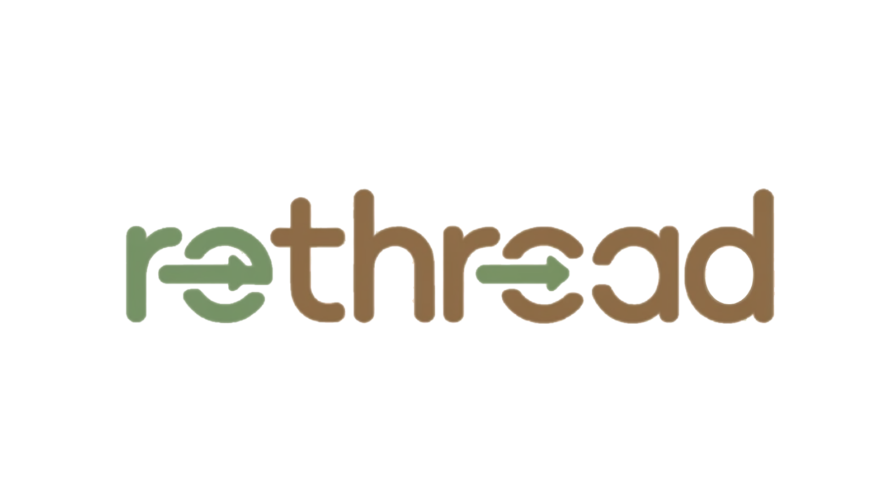

<p align="center">
  
</p>

<h1 align="center">ReThread</h1>

<p align="center">
  A sustainable fashion community that promotes upcycling through AI-powered recommendations, community sharing, and competitions.
</p>

---

## About

ReThread is a web application built for a fashion sustainability module. It encourages users to upcycle old clothing by providing AI-generated design recommendations and upcycled image previews, a community feed for sharing before & after transformations, themed competitions, and a leaderboard system.

## Features

### AI Upcycle Recommendations
Upload a photo of any clothing item and receive 3 creative upcycle suggestions powered by Grok AI. Each recommendation comes with detailed step-by-step DIY instructions and AI-generated image previews of the upcycled result.

### Community Feed
Browse a feed of user creations. Each post features before & after images, a description of the upcycling process, upvotes, and comments. Sort posts by Hot, New, or Top.

### Competitions
Themed upcycling challenges with deadlines. Users submit entries, the community votes, and winners earn ranked points. View active and past competitions.

### Leaderboard
Community rankings sortable by post karma or competition ranked points. Tap any user to view their full profile and creation history.

### User Profiles
Upload a profile photo, edit your display name and bio, and view your stats including karma, ranked points, and total posts.

## Tech Stack

| Layer | Technology |
|-------|-----------|
| Frontend | React.js |
| Icons | Lucide React |
| Fonts | Playfair Display, DM Sans |
| State Management | React Context API |
| AI Recommendations | Grok API (xAI) |
| AI Image Generation | Grok API (xAI) |
| Backend (planned) | Supabase (Auth, Database, Storage) |

## Project Structure

```
rethread/
├── public/
│   ├── logo.png
│   ├── avatars/            # User profile images
│   └── posts/              # Post before/after images
├── src/
│   ├── App.js              # Main app with bottom navigation
│   ├── index.js            # Entry point
│   ├── context/
│   │   └── AuthContext.js  # Authentication state management
│   ├── data/
│   │   └── mockData.js     # Mock users, posts, competitions
│   ├── styles/
│   │   └── global.css      # Global styles & CSS variables
│   ├── components/
│   │   ├── Avatar.js       # User avatar (supports image upload)
│   │   ├── PostCard.js     # Post card with upvotes & comments
│   │   └── UpvoteButton.js # Upvote button component
│   └── pages/
│       ├── AuthScreen.js       # Login / Sign Up
│       ├── CameraScreen.js     # Photo capture & AI recommendations
│       ├── FeedTab.js          # Home feed with sorting
│       ├── CompetitionsTab.js  # Competitions list & detail view
│       ├── LeaderboardTab.js   # User rankings
│       └── ProfileView.js     # User profile & creations
└── package.json
```

## Getting Started

### Prerequisites
- [Node.js](https://nodejs.org/) (LTS version)

### Installation

```bash
git clone https://github.com/perionsuck/rethread.git
cd rethread
npm install
npm start
```

Open [http://localhost:3000](http://localhost:3000) to view in browser.

### Demo Login
Enter any email and password (6+ characters) to sign in.

## Screenshots

*Coming soon*

## Roadmap

- [x] Community feed with upvotes and comments
- [x] AI upcycle recommendations (Grok)
- [x] AI-generated image previews (Grok)
- [x] Competitions with themed challenges
- [x] Leaderboard with karma and ranked points
- [x] User profiles with avatar upload
- [ ] Supabase authentication (email/password, OAuth)
- [ ] Database for posts, comments, and upvotes
- [ ] Image storage for user uploads
- [ ] Competition submission and voting system
- [ ] Dark mode
- [ ] PWA support for mobile installation

